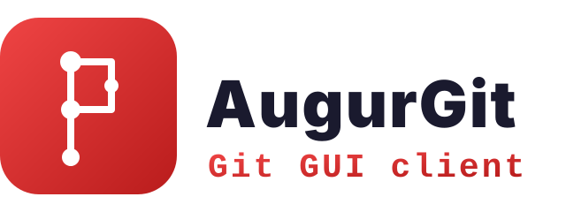

# Augur Git

<p align="center">
  
</p>

> Review the change. Decide what becomes history.

Augur Git is an open-source, local-first, review-first desktop Git client for
developers working with coding agents. The active Tauri application combines
a focused working-tree review surface, explicit local Git operations, and
visible Agent sessions.

It turns local repository changes into clear, navigable diffs so that a human
can understand, select, and approve what will become part of the project's
history.

Augur Git is designed to sit beside a terminal, an editor such as Neovim, and
a coding agent. It does not try to replace any of them. The terminal runs the
project, the editor handles focused changes, the agent produces larger changes,
and Augur Git provides the visual review surface between those changes and the
next commit.

## Why Augur Git exists

AI-assisted development has made producing code much faster, but understanding
and accepting code still requires human judgment. A coding agent can change
many files in a few minutes; the developer remains responsible for deciding
whether those changes are correct, coherent, and safe to keep.

Augur Git grew out of a practical workflow:

1. Run the application and development tools in a terminal.
2. Use a coding agent for substantial implementation work.
3. Make small, precise corrections in an editor.
4. Inspect the resulting Git changes before staging, committing, or pushing.

The missing piece was a fast, focused Git interface where review is the
primary activity rather than a secondary view hidden among repository-
management features.

The name reflects that idea. An augur reads signs to understand what may come
next. In Git, the commit graph records the past, the working tree contains a
possible future, and the developer decides which changes become history.

## Product definition

Augur Git is a **review-first Git client for local, AI-assisted development**.

Its primary job is to help a developer answer four questions:

- What changed?
- Why does the change matter?
- Which parts should be kept, revised, or discarded?
- Is the repository ready for the next commit or push?

Augur Git is not a coding agent, a code editor, a hosted pull-request platform,
or an automated judge of code quality. It complements those tools by providing
a dedicated local review layer:

```text
Coding agent or editor
          |
          v
   Working tree changes
          |
          v
      Augur Git review
          |
          +----> Return issues to the editor or agent
          |
          v
   Stage, commit, and push
```

## Design principles

- **Review comes first** — diffs, changed files, and repository context are the
  center of the experience, not an afterthought.
- **Complement the existing workflow** — Augur Git should work naturally beside
  terminals, editors, and coding agents instead of absorbing their roles.
- **Keep the human in control** — repository-changing operations require an
  explicit user action and surface their result or error.
- **Stay local by default** — repository inspection uses the system `git`
  executable. Augur Git has no account requirement and does not need a hosted
  service to review local changes.
- **Make large changes understandable** — navigation, layout, syntax-aware
  rendering, and responsive performance should make multi-file agent changes
  practical to review.
- **Build in the open** — the application, its design decisions, and its
  development process are available for users to inspect and improve.

## Applications

- **[Augur Git Tauri](tauri-app/README.md)** — the primary application under
  active development, built with Tauri 2, React, and Vite. Its frontend and
  Rust backend have independent dependencies, build commands, and application
  data.
- **[Augur Git Legacy](gpui-app/README.md)** — the legacy Rust application
  built with GPUI, retained for reference and existing users. It is no longer
  under active development.

The applications are separate implementations. They do not share source code,
assets, dependency manifests or lock files, build configuration, or runtime
settings. Their configuration formats are incompatible, and neither
application reads, imports, migrates, or writes the other's settings.

Each application directory contains its own setup, test, build, and license
information. Start commands from within the corresponding directory.

## Repository-wide guidance

The root [AGENTS.md](AGENTS.md) contains instructions that apply to both
applications. Application-specific agent instructions live in each
application directory. GitHub Actions are kept in [`.github/`](.github/).

The repository is licensed under the [Apache License 2.0](LICENSE). Each
application also carries its own copy for standalone packaging.
